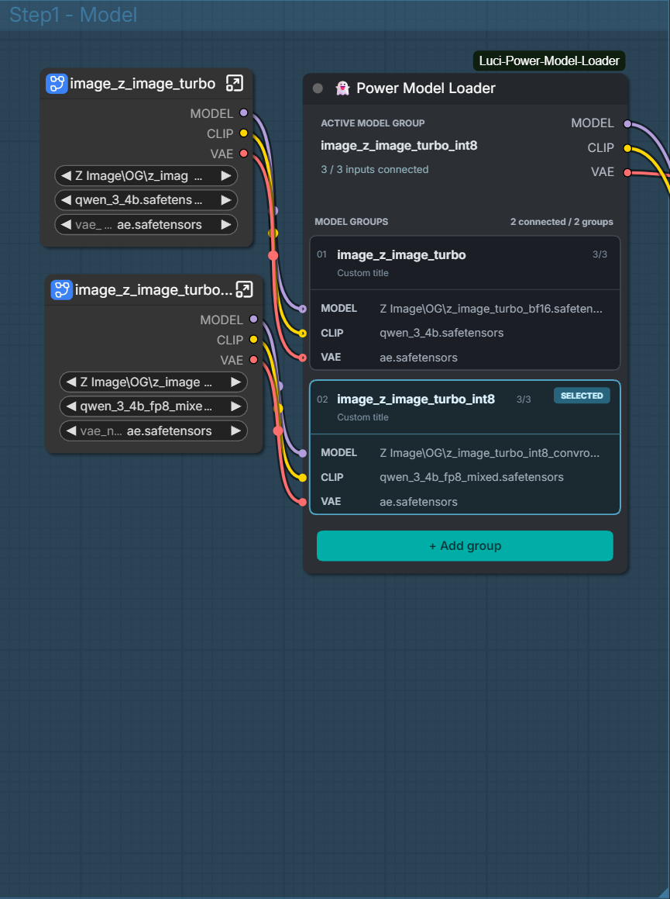
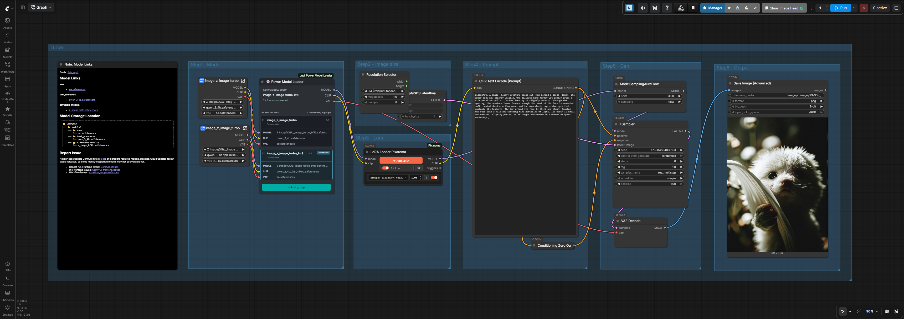

# 👻 Luci Model Loader

Part of the **👻 Luci** custom-node collection for ComfyUI.

## Preview

Switch between complete model bundles by selecting a group. Each group accepts
MODEL, CLIP, and VAE connections from your existing loaders or subgraphs.



**Status: experimental, v0.5.9.** Automated tests pass, but a successful live
generation with this release has not yet been verified. The custom UI targets
the classic canvas renderer, not every frontend rendering mode.

Version 0.5.9, under **👻 Luci → loaders**. Uses the existing
`PowerModelLoader` class ID to preserve workflows. Replace the previous folder;
do not install a second copy alongside it.

All 16 group triplets are now explicitly registered in the serialized input
schema, so added groups retain their input definitions during execution.
Adding a group preserves the current selection.

Before queuing, selected upstream standard model loaders in Bypass mode are
restored to Always, following their actual subgraph output paths. Unselected
groups and unrelated processors are not changed. Muted (Never) nodes are not
automatically enabled. The selected-group status warns about bypassed sources.

Outputs are stacked at the top-right. Each card shows connected inputs out of
three, and the heading counts complete connected groups versus total groups.
New/default groups follow the MODEL source node or subgraph title live.
Double-click to override; right-click **Use connected title** restores automatic
naming. Existing explicitly named groups retain their names.

New nodes start at 420 pixels wide and can shrink to 320 pixels. Existing
workflow sizes are preserved. Filenames truncate to the available space.
The Add group action is a rounded mint-green button below the final card.
Version 0.5.9 renames the displayed node to **👻 Luci Model Loader** and uses
charcoal surfaces with mint-green accents. The installation folder remains
`ComfyUI-Luci-Power-Model-Loader` and the node ID is unchanged.

The custom canvas layout targets ComfyUI's classic canvas renderer. Filename
discovery reads known loader widgets, including immediate nodes inside a
subgraph. Unknown/custom source nodes display their title as a fallback.

Luci Model Loader is a ComfyUI custom node that switches one complete external
model bundle at a time. Each named group accepts three normal ComfyUI links:

- `MODEL`
- `CLIP`
- `VAE`

The selected group is forwarded unchanged to the node's `MODEL`, `CLIP`, and
`VAE` outputs. Model filenames remain in your normal upstream loader nodes.

## Important behavior

- Up to 16 groups.
- Only the selected group is requested through ComfyUI lazy evaluation.
- Unselected upstream loader branches should not execute.
- Every group is drawn as a bounded card in the classic canvas frontend.
- Click a group card to select the complete model bundle.
- Double-click a group header to rename it in place.
- Right-click a group header to rename or delete that group.
- Input rows display the connected upstream loader's actual model filename when
  it is available, including common `unet_name`, `ckpt_name`, `clip_name`, and
  `vae_name` widgets.
- The node does not load files, validate model compatibility, or mix components
  from different groups.
- A selected group must have all three inputs connected.

## Installation

### Git clone

From your `ComfyUI/custom_nodes` directory:

```sh
git clone https://github.com/ariefinariean/ComfyUI-Luci-Power-Model-Loader.git
```

Restart ComfyUI and hard-refresh the browser (Ctrl+F5). Install only one copy
of this node. Older folders named `ComfyUI-Power-Model-Loader` and
`Luci-Power-Model-Loader` register the same node ID and can conflict.

### Manual installation

1. Copy the `ComfyUI-Luci-Power-Model-Loader` folder into:

   `ComfyUI/custom_nodes/`

2. Keep only one installed copy: remove older `ComfyUI-Power-Model-Loader` or
   `Luci-Power-Model-Loader` installations before using this package. They
   register the same node ID.
3. Restart ComfyUI.
4. Find **👻 Luci Model Loader** under **👻 Luci → loaders**.

There are no Python package dependencies.

## Usage

1. Add your normal model loader nodes to the workflow.
2. Add **Luci Model Loader**.
3. Connect one loader's `MODEL`, `CLIP`, and `VAE` outputs to Group 1.
4. Double-click the group card header to give it a useful name inline.
5. Use **Add input group** for additional model bundles.
6. Click the desired group card to select that complete bundle.
7. Connect the Luci Model Loader's three outputs to the rest of your workflow.

Group names, group sockets, connections, and the selected group are stored in
the workflow.

## Example workflow

The loader routes the selected group's MODEL, CLIP, and VAE to downstream
nodes while keeping the rest of the workflow connected.



Screenshots supplied by the author illustrate the UI and workflow layout;
they are not a verification of every supported model or frontend version.

## Validation

Run the backend tests from this directory:

```powershell
python -m unittest discover -s tests -v
node tests/test_frontend.mjs
```

The included isolated tests cover the 16-group schema, selected-only lazy requests,
unchanged passthrough values, clear missing-input errors, group bounds, boxed
group rendering, filename discovery, direct header renaming, resize reflow,
custom slot layout, card selection, context-menu deletion, and group creation.
They also cover selected-only bypass restoration inside subgraphs. These are
not end-to-end ComfyUI generation tests; real frontend compatibility still
requires validation.

## Troubleshooting

- If a group shows 3/3 but execution reports missing inputs, check the modes
  of loaders **inside** the connected subgraph. Standard selected loaders in
  Bypass are restored to Always before queuing; muted (Never) nodes and unknown
  custom loaders are not automatically enabled.
- Cable counts indicate physical connections, not model compatibility or
  guaranteed execution readiness.
- If UI changes do not appear, restart ComfyUI, hard-refresh the browser, and
  check for duplicate installations.
- To report a bug, open a GitHub issue with your ComfyUI/frontend versions,
  error report, and a minimal workflow without private prompts or file paths.

## License

MIT. See [LICENSE](LICENSE).

## Compatibility note

The backend uses ComfyUI's established V1 custom-node schema plus lazy input
metadata. The frontend uses ComfyUI's standard extension hook and LiteGraph
input/widget methods. Because ComfyUI's frontend evolves, verify the UI against
the specific ComfyUI build where you plan to use it. The bounded-card drawing is
designed for the classic canvas renderer shown in the supplied screenshots.
